# TaskTogether ERD

이 문서는 `TIMECLOUD` 스키마의 핵심 엔터티를 **업무 관점**에서 간단히 이해하기 위한 ERD 요약입니다.
실제 Oracle에는 명시적 FK 제약이 거의 없어서, 아래 관계는 **컬럼명 / 쿼리 사용 방식 / 데이터 구조**를 기준으로 정리했습니다.

## Mermaid ER Diagram

```mermaid
erDiagram
    TIMECLOUD_DOMAIN ||--o{ TIMECLOUD_DOMAIN_USER : has
    TIMECLOUD_USER ||--o{ TIMECLOUD_DOMAIN_USER : belongs_to

    TIMECLOUD_DOMAIN ||--o{ TIMECLOUD_TASK : scopes
    TIMECLOUD_USER ||--o{ TIMECLOUD_TASK : owns
    TIMECLOUD_TASK ||--o{ TIMECLOUD_TASK : parent_of
    TIMECLOUD_TASK ||--|| TIMECLOUD_TASK : list_root

    TIMECLOUD_TASK ||--o{ TIMECLOUD_ACTIVITY : has
    TIMECLOUD_USER ||--o{ TIMECLOUD_ACTIVITY : creates

    TIMECLOUD_TASK ||--o{ TIMECLOUD_FEEDBACK : has
    TIMECLOUD_USER ||--o{ TIMECLOUD_FEEDBACK : writes

    TIMECLOUD_TASK ||--o{ TIMECLOUD_FILE : has
    TIMECLOUD_USER ||--o{ TIMECLOUD_FILE : uploads

    TIMECLOUD_TASK ||--o{ TIMECLOUD_OBSERVER : has
    TIMECLOUD_USER ||--o{ TIMECLOUD_OBSERVER : observes

    TIMECLOUD_TASK ||--o| TIMECLOUD_PROJECT : project_meta
    TIMECLOUD_USER ||--o{ TIMECLOUD_PROJECT : owns

    TIMECLOUD_USER ||--o{ TIMECLOUD_NOTIFICATION : receives
    TIMECLOUD_USER ||--o{ TIMECLOUD_NOTIFICATION : creates
    TIMECLOUD_TASK ||--o{ TIMECLOUD_NOTIFICATION : about

    TIMECLOUD_USER ||--o{ TIMECLOUD_FAVORITE : saves
    TIMECLOUD_TASK ||--o{ TIMECLOUD_FAVORITE : target_task

    TIMECLOUD_DOMAIN ||--o{ TIMECLOUD_TEAM : has
    TIMECLOUD_TEAM ||--o{ TIMECLOUD_TEAM_USER : has
    TIMECLOUD_USER ||--o{ TIMECLOUD_TEAM_USER : joins

    TIMECLOUD_USER ||--o{ TIMECLOUD_USER_IMAGE : has
    TIMECLOUD_USER ||--o{ TIMECLOUD_USER_PARTNER : links_to_partner
    TIMECLOUD_USER ||--o{ TIMECLOUD_USER_SNSMAP : maps_to_sns

    TIMECLOUD_USER ||--o{ TIMECLOUD_ACCESSLOG : accesses
    TIMECLOUD_DOMAIN ||--o{ TIMECLOUD_ACCESSLOG : within_domain
```

## 핵심 엔터티

### 1. TIMECLOUD_TASK
가장 중심이 되는 엔터티입니다.
- 업무 단위/태스크
- `N_PARENT_IDX` : 부모 태스크
- `N_LIST` : 같은 태스크 트리(최상위 루트 기준 그룹)
- `N_OWNER_IDX` : 담당/소유 사용자
- `N_DOMAIN_IDX` : 도메인 소속

### 2. TIMECLOUD_PROJECT
프로젝트 메타 정보입니다.
- 실제 구조상 **태스크의 최상위 루트(`N_TASK_IDX`)에 매핑되는 부가 정보**에 가깝습니다.
- 모든 태스크가 프로젝트를 갖는 것은 아닙니다.

### 3. TIMECLOUD_ACTIVITY / FEEDBACK / FILE / OBSERVER
태스크에 붙는 주요 협업 도구입니다.
- `ACTIVITY` : 일정/액티비티
- `FEEDBACK` : 댓글/피드백
- `FILE` : 첨부파일 메타데이터
- `OBSERVER` : 참조자/CC

### 4. TIMECLOUD_USER / DOMAIN / TEAM
사람과 조직 관련 엔터티입니다.
- `USER` : 사용자
- `DOMAIN` : 회사/조직 경계
- `TEAM` : 도메인 내부 팀
- `DOMAIN_USER`, `TEAM_USER` : 다대다 매핑

## 주의할 점
- 실제 DB에는 **FK 제약이 약하거나 거의 없어서**, 애플리케이션 로직이 관계 무결성을 많이 책임집니다.
- `TIMECLOUD_NOTIFICATION`, `TIMECLOUD_FAVORITE`는 `V_TBL_NM + N_TBL_IDX` 같은 **폴리모픽 참조 패턴**을 사용합니다.
- `TIMECLOUD_FILE`은 메타데이터는 있으나, 백업에는 원본 파일이 누락된 경우가 있습니다.
